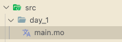
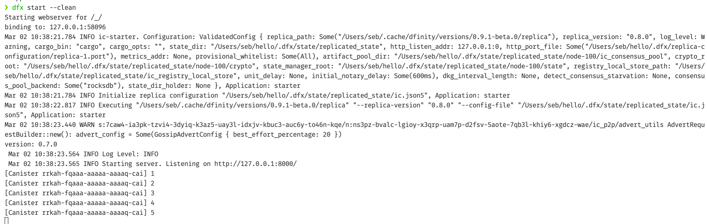
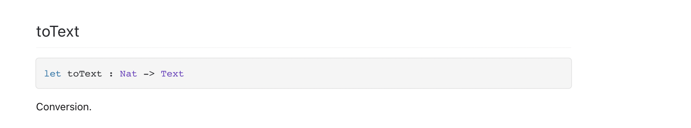

# Daily guide : day 1 🥚

Welcome into the first day of the Motoko Bootcamp ! <br/>
This guide is meant to cover some basics on : **Actor**, **function**, **types**,**variables**, **loops** and **modules**.

# Prerequisites ✅

- Check you have dfx installed on your machine.

  ```
  dfx --version
  ```

- Start a new project called **day_1** and turn on your local replica.

  ```
  dfx new day_1
  cd day_1
  dfx start
  ```

# Motoko 👻

Motoko is a language that has been developed by the **Dfinity** foundation specifically for the Internet Computer. </br>

A motoko file is a file with the indication .mo at the end.

Let's create a new project with dfx using the command :

```
dfx create hello
```

You can open the new project with your IDE (Visual Studio Code or other) and you will notice inside src/hello a file called main.mo : this is a motoko file.

<p align="center">  </p>

# Actor 🤖

If you open the main.mo file you will notice that the first word is **actor**.

```
actor {

};
```

An **actor** is simply the representation of a canister for the Motoko language.

On the Internet Computer each canister is separated from all other canisters and can only communicate with other canister through **asynchronous** messages. 📭

# Function ⚙️

This actor has only one function called **greet**. <br/>

```
actor {

    public func greet(name : Text) : async Text {
        return "Hello, " # name # "!";
    };
};

```

## Public / Private

Notice that this function is **public** : it means it can be called by other actors and by users on the Internet Computer. ✅ <br/>

You will see later that function can sometimes be **private** (in that case it can only be called by the actor himself and not by external entities). ⛔️

## Argument & Return value

The next thing you should notice is the **argument** of the function greet : the argument here is called name and is of type **Text**.

The return value of this function is of type **async Text**. <br/> This means that the person or canister calling will have to **await** to get the result. ⏱

To understand this concept you need to imagine what it means to be a canister on the Internet Computer : at any moment an user or an other canister can call you through any of your **public** function. <br/> <br/> What if you were already answering a previous request ? You are a simple program you can only do one thing at a time : you need to finish what you are currently doing and **then** you will be able to process the incoming request. ⚡️ <br/>

By specifying that the return value is of type **async Text** you indicate to anyone that if they call your **greet** function they will get back a **Text** value but they will have to wait a bit. 🏎

**Remember** : every **public** function of an actor has a return value that is **async**.

## Calling a function

We can call the greet function using <a href="https://smartcontracts.org/docs/developers-guide/cli-reference/dfx-parent.html" target="\_blank"> dfx </a> by running the following commands in your terminal.

```
dfx deploy day_1
```

Once the canister has been deployed.

```
dfx canister call day_1 greet '("world")'
("Hello, world!")
```

**day_1** is the name of the canister.
<br/>
**greet** is the function we are calling.
<br/>
**"world"** is the argument we are sending.
Note : when using dfx you should put your argument(s) into **'( )'**.
<br/>
**"Hello, world"** is the value returned by the function.

More generally you can call any canister method with any argument, using this generic command.

```

dfx canister call <CANISTER_NAME> <METHOD_NAME> '(ARGUMENT)'

```

# Variables 💾

You can declare variables using the **let** keyword and the assignement operator : **=** .
<br/> You can think of a variable has a box where you can store anything and access it later using the name of this variable. 📦

```
let a = 5;
let b = a + 3; // 8
```

By default variables are **immutables** in Motoko, this means that once a variable has been assigned a value you cannot change it. <br/>
You can declare **mutable** variables using the **var** keyword.

```
var a = 5;
var b = a + 3; // 8
```

You can reassign a new value inside **mutable** variable with the reassignement operator : **:=**.

```
var a = 5;  //  First declaration.
var a := 6; //  Reassignement to a new value.
```

Take a look at the following actor declaration 👀.

```
actor {
    let a = 4;
    a := 5;
};
```

 <details>
        <summary style="color:green"> 🤔  What do you think would happen if we tried to deploy this actor ? </summary>
        <br/>
        This would result in an error, we are trying to reassign a <strong> mutable </strong> variable. The exact error is : <strong> <i> type error [M0073], expected mutable assignment target. </strong> </i>
</details>
<br/>

# Types 🍎

In Motoko, every variable has a type, to indicate the type we use the symbol <strong> : </strong> <br/> Here's a few examples of variable with their type and their value.

```
let name : Text = "Motoko";

let age : Nat = "2";

let ghost : Bool = true;
```

In most cases, you can omit the type of a variable and Motoko will deduce it for you. For instance, if you declare a variable with this expression :

```

let name = "Motoko";

```

Motoko will automatically know that this variable is of type **Text**. <br/>
However for the sake of clarity : I **strongly advise** you to use the the type of variables you are using and that's what we will do in the following lessons.

# Error 😵

Motoko has strict rules around types, during this week you'll probably encounter a lot of **type errors**. 👩‍⚖️ <br/>

One example of such an error would be to try to add two variables of different types. Let's try to add a **Text** with a **Nat**.

```

public func add_five(number : Text) : async Text {
    return (number + 5);
};

```

Trying to compile this code will result in an type error.

```

type error [M0050], literal of type
Nat
does not have expected type
Text

```

We will cover many types in details but for the moment try to remember that you should always keep an eye on what are the types of the variables you are using.

# Nat and operations 🧮

Let's start with the **Nat** type. This type is meant to represent any natural number. <br/>

Natural numbers are : 0,1,2,3 ... ∞

## Addition ➕

You can add two numbers using the addition operator **+**

```

let a : Nat = 1 + 1;

```

## Multiplication ✖️

You can multiply two numbers using the multiplication operator : **\***

```

let a : Nat = 10 * 10;

```

## Substraction ➖

You can substract two numbers using the substraction operator : **-**

```

let a : Nat = 10 - 5;

```

☢️ Be careful when using substraction operator with the type Nat. ☢️ <br/> <br/> The type **Nat** is composed of positive numbers only. <br/> If the result of the substraction is below 0, your value won't be of type Nat anymore and if your program if expecting a value of type **Nat** it might **trap**.

```
actor {
    let a : Nat = 1 - 2;
};
```

Trying to deploy this actor would result in a **subtraction underflow** causing a **trap**..

```
Error: The Replica returned an error: code 5, message: "Canister rrkah-fqaaa-aaaaa-aaaaq-cai trapped explicitly: Natural subtraction underflow"
```

💡 A **trap** is an error that happen during the **execution** of a program, when a **trap** happen the execution of the programm is stopped and a, error message is returned.

## Division & modulo ➗

You can divide two numbers using the **division** operator : **/** .
<br>
You can get the remainder of a divided by b using the **modulo** operator : **%** .

```
let a : Nat = 10 / 2;
let b : Nat = 3 % 2;
```

In this case **a** equals **5** and **b** equals **1**.

# Challenge 🎮

Take a break and try completing challenge 1 to 4.

# Boolean and conditions 🟢 🔴

Let's move on to a new type called **Bool**. <br/>
This type is relatively special because it his composed of only two values : **true** and **false**.

This type is often used with **if condition** to add conditions to your function.

```
if(true) {
    // Do this
} else {
    // Do that
};

```

Now let me introduce the **equality** operator **==**. <br/>This operator is used to test if two values are equals. It returns a boolean indicating **true** or **false**.
We can actually combine the **==** operator with the **if condition**.

```
if(1 == 1) {
    return ("Hello");
} else {
    return ("Ola");
};
```

❓ What do you think this expression will return ?

It will return **Hello** indeed. <br/>
The condition 1 == 1 is always **true** so this expression is not extremly interesting. <br/> <br/> Let's move to something else and introduce variables into our condition.

```
actor {
    public func equal_to_one (n : Nat) : async Text {
        if(n == 1) {
            return("n is equal to 1 !");
        } else {
            return ("n is not equal to 1 !");
        };
    };
};

```

We can actually test our function by deploying our actor and calling this function with different parameters.

```
dfx canister call hello equal_to_one '(1)'
("n is equal to 1 !")
```

```
dfx canister call hello equal_to_one '(2)'
("n is not equal to 1 !")
```

Let me introduce other **relational operators** :

- The **<** (less than) operator.
  ```
  3 < 5     //true
  6 < 2     //false
  1 < 1     //false
  ```
- The **>** (more than) operator.
  ```
  3 > 5     //false
  6 > 2     //true
  1 > 1     //false
  ```
- The **<=** (less than or equal to) operator.

  ```
  3 <= 5    //true
  6 <= 2    //false
  1 <= 1    //true
  ```

- The **>=** (more than or equal to) operator.
  ```
  3 >= 5    //falser
  6 >= 2    //true
  1 >= 1    //true
  ```
- The **!=** (not equal) operator.
  ```
  1 != 1    //false
  1 != 0    //true
  ```

We can use some of those new operators to rewrite our actor.

```
actor {
    public func inf_to_one (n : Nat) : async Text {
        if(n < 1){
            return("n is below 1 !");
        };
        if( n > 1){
            return("n is above 1 !");
        } else {
            return("n is equal to 1!");
        };
    };
};

```

You now have the mission to deploy this actor and test this function for different values. 😉

# Challenge 🎮

Take a break and try completing challenge 5 and 6.

# Array 🗃

In Motoko, an **array** is a collection of **similar** data elements.

```
let array_1 : [Text] = ["Motoko", "is", "a", "great", "language", "."];

let array_2 : [Nat] = ["05", "07", "2021"];

let array_3 = ["This is not correct", 12345];   ⛔️ Not valid
```

As you can see array_3 is not valid; we are trying to mix a value of type Text with a value of type Nat. <br/> Again, an array can only contains elements of the similar type.

🕵️‍♂️ To access an element in an array we use an **index**. <br/> Array are indexed starting at zero. This means the first element in the array can be accessed using **array[0]**, the second element using **array[1]** and so on.
<br/> <br/> You can access the size of an array using **array.size()**.

Let's rewrite our actor and play with what we've learned.

```
actor {

    let array : [Text] = ["Motoko", "is", "a", "great", "language", "."];

    public func check_index(n : Nat) : async Text {
        return(array[n]);
    };

    public func check_size() : async Nat {
        returrn(array.size());
    };
};
```

💡 Note that the function check_size has no argument.

<br/>

❓ What do you think this command will return ?

```
dfx canister call hello check_size '()'
```

❓ What about this one ?

```
dfx canister call hello check_index '(6)'
```

✅ The first command will return **6** the second one should report a **trap** error indicating than the index is out of the bounds of the Array.

# Loop ⏭

We can loop over an array using a **for** loop and the following syntax.
Copy and paste the following code and deploy the actor.

```
import Debug "mo:base/Debug";

actor {
    let array : [Nat] = [1, 2, 3, 4, 5];

    public func test() : async () {
        for (value in array.vals()){
            Debug.print(debug_show(value))
        };
    };
};

```

This syntax means that we will go trough all values in the array and print them.
Once you've deployed the actor, run the following command.

```
dfx canister call hello test '()'
```

In your terminal (in the window that is running the replica) you should see this output.

<p align="center">  </p>

# Challenge 🎮

Take a break and try completing challenge 7 and 8.

# Module 🧩

As you've probably noticed in the previous actor declaration, we have imported a **module** (called **Debug**). <br/>

A module is composed of code written by someone else that you can use in your own program. <br/>
We will see different ways to import modules and even how to create your own modules.
However, for today we only need to know how to import modules from the **base library**.

💡 The **base library** is a set of modules to handle common operations on the most used types (Array, Bool, Nat, Int, Text...).

- The **source code** for this library is accessible <a href="https://github.com/dfinity/motoko-base" target="_blank"> here </a> and is maintained by engineers from the Dfinity foundation and community members.
  <br/>

- Each module has a **documentation** page where you can read about the available functions. Here is the documentation page for the <a href="https://smartcontracts.org/docs/base-libraries/Text.html" target="_blank"> Text </a> module.

The **source code** is meant to understand how a specific module was written whereas the **documentation** is meant to understand how you can use a module. <br/> You need to know how to use the **documentation** but you don't need to understand how the **source code** for these modules was written (expect if you are curious 👀).

Here's an example that show how to import the <a href="https://smartcontracts.org/docs/base-libraries/Nat.html" target="_blank"> **Nat** </a> module and use the **toText** function.

```
import Nat "mo:base/Nat";

actor {
    public func nat_to_text(n : Nat) : async Text {
        return(Nat.toText(n));
    };
};
```

Here's the part of the documentation covering the function used.

<p align="center">  </p>

💡 At this point you might be wondering how we were using the type **Nat** in previous examples without importing the corresponding module. <br/> <br/>This is an important subtility to understand : the **_type_** Nat is by default available in Motoko but if you need to use one function from the **_module_** Nat you need to import the module before.

```
actor {
    let a : Nat = 5; ✅ Valid.
    public func nat_to_text(n : Nat) : async Text {
        return(Nat.toText(n)); ⛔️ Incorrect without importing the module.
    };
};

```

# Challenge 🎮

Take a break and try completing challenge 9 and 10.
