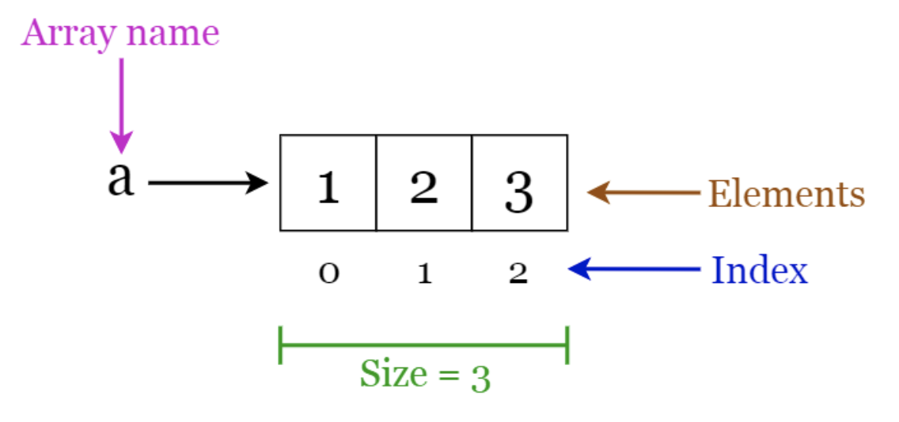
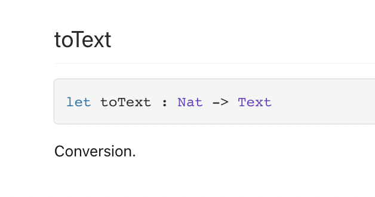

# Daily guide : day 3 🐥

Welcome into the **day 3** of the Motoko Bootcamp ! <br/>
Today we will cover the following topics : **Array**, **Optional and Generic type**, and **Higher order functions**.

# Prerequisites ✅

- Make sure you have dfx installed on your machine.

  ```
  dfx --version
  ```

- Start a new project called **day_3** and turn on your local replica.

  ```
  dfx new day_3
  cd day_3
  dfx start
  ```

# Array 🚚

Datastructures in any programming language are essential, on almost every program you need to store and access data into datastructures. 💿

<br/> Data structures come in a lot of differents forms, each one has its own advantages and drawbacks, there is no perfect datastructures (even though some are more used than others), the optimal datastructure for a given task depends on the situtation and on your priorities.

We have already played with **Array**, but today we'll see exactly how they are created and many useful functions to use with them.

<p align="center">  </p>

An array is a fixed-length data structure, once an array of a specified size is created you cannot increase the capacity expect by creating a completely new array.
This means that at the time the code will run, it will always **know** what is the size of the array. (This is not the case for all datastructures) <br/>
Accessing an element in an array is extremely simple, you only need to request the value at a specific index.

```
let array : [Nat] = [10, 3, 4, 5];
let a : Nat = array[3]; // 5
```

You can access tothe size of an array using **.size()**.

```
let array : [Nat] = [1, 3 , 4];
let size : Nat = array.size() // 3
```

🕵️ Deeply understanding why accessing an element in an array is so efficient involves explaining how the computer manages memory, this is out of scope for this lesson but I'll try to explain it in simple terms : if we know the size of an array when the code is compiled, we can allocate the exact memory for it, remember the memoy location of the first value in the array and write all other values in the memory locations directly following the location of the first value. <br/> <br/>Then if we want to access any element in the array we just need to look at the location of the first element and eventually jump to the right memory location by taking into account the index of the element we are trying to access.

In Motoko, by default arrays are **immutable** (like variables). This means once the array is created you can only **read** the values inside but cannot **write**.

You can create **mutable** arrays but you need to use the keyword **var**.

```
let array_1 : [Nat] = [1, 2, 3]; // immutable

let array_2: [var Nat] = [1, 2, 3]; // mutable
```

```
array_1[1] := 0; // ⛔️ impossible to reassign values of an immutable array.

array_2[1] := 0; // ✅ valid reassignment in a mutable array.
```

# Challenge 🎮

Take a break and try completing challenge 1 to 3.

# Optional type ❓

In Motoko there is a special value called **_null_**. <br/>
This value represents the absence of a result, this is useful if you want one of your function to indicate that it has no specific return value.
The type of **_null_** is **Null** (this type contains only one value).

Let's say you want to create a function named **_index_of_one_** that takes an array of type **[Nat]** and returns the first index such that the value at that index is equal to 1. <br/> You also want this function to return **_null_** if no matching index was found.

```
actor {
    public func index_of_one(array : [Nat]) : async Nat {
        for((number,index) in array.vals()){
            if(number == 1) {
                return index;
            }
        };
        return null;
    };
};
```

This declaration is not valid because **_null_** is not a type Nat 😕 <br/>
Trying to deploy this code would result in the following error.

```
type error [M0050], literal of type
  Null
does not have expected type
  Nat
```

We need a way to explain to Motoko that the value returned can be either a **Nat** or **_null_**. <br/> <br/> Luckily there is a notation exactly for that, it's called the optional type : **?T**. <br/>
In our case we would use **?Nat** because we are returning **Nat** or **_null_**.

We can rewrite our actor using our new type.

```
actor {
    public func index_of_one(array : [Nat]) : async ?Nat {
        for((number,index) in array.vals()){
            if(number == 1) {
                return index;
            }
        };
        return null;
    };
};
```

Sometimes in your code you will need to handle those optional values, you can do so with a **switch** expression.

```
import Nat "mo:base/Nat";
actor {
    public func null_or_nat(n : ?Nat) : async Text {
        switch(n){
            // Case where n is null
            case(null) {
                return ("The argument is null");
            };
            // Case where n is a nat
            case(?something){
                return ("The argument is : " # Nat.toText(something));
            };
        };
    };
};
```

You can deploy this actor and try those commands.

```
dfx canister call day_3 null_or_nat '(opt 4)'
("The argument is : 4")
```

🕵️ Notice again the difference between Candid and Motoko. <br/>
Here we have to use the Candid syntax **opt 4** whereas in Motoko we could just write **?4**.

```
dfx canister call day_3 null_or_nat '(null)'
("The argument is null")
```

☢️ It's important to understand that the type **?Nat** and **Nat** are really different. <br/> If a function is expecting a value of type **Nat** as parameter and it receives a value of type **?Nat** it will not appreciate. 😠

Take a loot at something we shouldn't do, we'll use again the same code from the previous example but without the **switch** expression.

```
import Nat "mo:base/Nat";
actor {
    public func null_or_nat(n : ?Nat) : async Text {
        return ("The argument is : " # Nat.toText(something)); ⛔️ what is the type of something at this point?
    };
};
```

This code will not compile because the function toText is expecting a parameter of type Nat as we can see in the documentation.

<p align="center">  </p>

Some functions accept optional types, but not this one. <br/>
I hope you now appreciate the importance of **switch** / **case**.

# Generic type 👤

I have briefly introduced the concept of generic type when we introduced the optional type with the notation **?T**. Let's dive into it.

The generic type **T** allow us to write more general code, that can work with different types and be reused.

Let's say we want to write a function called **_is_array_size_even_** that returns a **Bool** indicating if the size of the array is even or not.</br>
We could write something like this

```
public func is_array_size_even(array : [Nat]) : async Bool {
    let size = array.size();
    if(size % 2 == 0){
        return true;
    } else {
        return false;
    };
};
```

This function is valid, but it only works if our array is filled with **Nat**. What about an array with **Text** values inside ?

- An quick and dirty solution would be to create a lot of different functions for each type of array we want to use : **\_is_array_size_even_nat** **\_is_array_size_even_text** **\_is_array_size_even_char** ...
  I hope you agree that this solution sucks.

- A better solution is to use the generic notation : **T**. This basically allow us to create **one** generic function that we can reuse for all the types available in Motoko.

```
public func is_array_size_even<T>(array : [T]) : async Bool {
    let size = array.size();
    if(size % 2 == 0){
        return true;
    } else {
        return false;
    };
};
```

T means "whatever type you want" and [T] means "whatever type you want as long as it's an array".

🕵️ Notice the <T> following the name of the function. It means that this function now depends on the type of T. <br/> If you want to use the array_size function you'll need to specify for which type you are going to use it !

```
func is_array_size_even<T>(array : [T]) : Bool {
    let size = array.size();
    if(size % 2 == 0){
        return true;
    } else {
        return false;
    };
};

let array : [Nat] = [1,2,3,4];
let bool : Boolean = is_array_size_even<Nat>(array); // I indicate to the compiler which type I'm gonna use the function on.
```

We've used T to represent the generic type but you will also see A or B or C being used in the documentation, this doesn't change anything.

# Challenge 🎮

Take a break and try completing challenge 4 to 6.

# Higher order functions 🏋️‍♀️

So far, we've only seen functions taking simple arguments (**Nat**, **Text**, **Char**...) but functions can also take other functions as arguments, such functions are called **higher order function**.

The **Array** module contains several higher order function, those are really powerful and useful methods so I'll present some of them.

- <a href="https://smartcontracts.org/docs/base-libraries/Array.html#find" target="_blank"> **Find** </a> : This function takes two parameters [A] an array and **f** a function that takes a value of type A and returns a **Bool**. (f is called a **predicate**).<br/>This function returns the first value for which the **predicate** is **true**.

```
import Array "mo:base/Array";
actor {
    let f = func (n : Nat) : Bool {
        if (n > 10) {
            return true
        } else {
            return false
        };
    };

    public func mystere(array : [Nat]) : async ?Nat {
        return(Array.find<Nat>(array, f));
    };

};
```

🕵️ Notice this code sample makes use of the 3 concepts we've been discussing about : Optional type, Generic type and Higher-order functions. 😎

<details>
        <summary style="color:green"> 🤔 What do you think <strong> mystere([1,4,5,18,0,2,3]) </strong> will return ? </summary>
        <br/>    
        The first value above 10 in the array so <strong> ?18 </strong> (do not forget that the value is of type <strong> ?Nat </strong> because this function might return <strong> <i> null </i> </strong>).
		<br/><br/>
    </details>
	<br/>

- <a href="https://smartcontracts.org/docs/base-libraries/Array.html#filter" target="_blank"> **Filter** </a> : This function also takes an array [A] and a **predicate** f and returns a new array [A] where only values that validate the predicate are kept.

We can even reuse the same predicate as in the previous example. ♻️

```
import Array "mo:base/Array";
actor {
    let f = func (n : Nat) : Bool {
        if (n > 10) {
            return true
        } else {
            return false
        };
    };

    public func surprise(array : [Nat]) : async ?Nat {
        return(Array.filter<Nat>(array, f));
    };
};
```

<details>
        <summary style="color:green"> 🤔 What do you think <strong> surprise([1, 23, 4, 25, 12]) </strong> will return ? </summary>
        <br/>    
        An array where only values above 10 are kept (the order is not modified) : <strong> [23, 25, 12]</strong>.
		<br/> <br/>
    </details>
	<br/>

- <a href="https://smartcontracts.org/docs/base-libraries/Array.html#fmap" target="_blank"> **Map** </a> : This function (again) takes an array [A] but this time f is a function taking a value of type A and returning a value of type B. This function simply apply the function f to **all** elements in the array and returns the new array.

```
import Array "mo:base/Array";
actor {
    let f = func (n : Nat) : Nat {
        return(n + 1);
    };

    public func riddle(array : [Nat]) : async [Nat] {
        return(Array.map<Nat, Nat>(array, f));
    };
};
```

<details>
        <summary style="color:green"> 🤔 What do you think <strong> riddle([0, 0, 0, 0]) </strong> will return ? </summary>
        <br/>    
        A new array where all values have been increased by one : <strong> [1, 1, 1, 1]</strong>.
		<br/> <br/>
    </details>
	<br/>

# Challenge 🎮

Take a break and try completing challenge 7 to 10.
